<h1 align="center">基于Spring Boot 的银行账目账户管理系统【带论文】</h1>

- <b>完整代码获取地址：从戎源码网 ([https://armycodes.com/](https://armycodes.com/))</b>
- <b>技术探讨、资料分享，请加QQ群：692619798</b>
- <b>作者微信：19941326836  QQ：3645296857</b>
- <b>承接计算机毕业设计、Java毕业设计、Python毕业设计、深度学习、机器学习</b>
- <b>选题+开题报告+任务书+程序定制+安装调试+论文+答辩ppt 一条龙服务</b>
- <b>所有选题地址 ([https://github.com/Descartes007/allProject](https://github.com/Descartes007/allProject)) </b>

## 一、项目介绍

### 基于 Spring Boot 的银行账目账户管理系统，系统角色主要为管理员与普通用户，主要功能如下：
### 管理员（后台管理人员）：
- 基本操作：登录、修改密码、获取/修改个人信息
### 用户管理：用户列表/分页、查看详情、新增/编辑/删除、重置密码、注册、获取 session 用户信息
### 账户管理（开户）：账户列表/分页、查看详情（含关联用户）、新增/编辑/删除、批量 XLS 导入
### 存取业务管理：存取记录列表/分页、查看详情（含关联账户/用户）、新增（存/取时自动更新账户余额）、编辑、删除、批量导入
- 挂失管理：挂失记录 CRUD、详情（含关联账户/用户）、批量导入
- 公告管理：公告 CRUD、图片/附件支持、批量导入
- 文件管理：文件上传/下载，上传结果可写入配置项
### 普通用户（系统终端用户）：
- 账户自查：查看本人账户信息与余额、账户详情
- 存取操作：发起存款/取款请求（通过前端调用存取接口，后端更新余额并记录流水）
- 挂失操作：提交/查看挂失记录
- 基本操作：登录、注册、退出、获取/修改个人信息
- 文件上传（如个人资料/照片）与查看下载

## 二、项目技术

- 编程语言：Java（后端）
- 项目架构：B/S 架构（前后端分离，前端基于 Vue，后端基于 Spring Boot）
- 前端技术：
- 框架/库：Vue.js (2.x)、Vue Router，Element UI，Axios（封装为 src/utils/http.js，自动在 Header 添加 Token）
- 后端技术：
- 框架：Spring Boot（Controller、DI、MultipartFile 上传等），MyBatis-Plus，FastJSON，MySQL

## 三、运行环境

- JDK版本：1.8及以上都可以
- 操作系统：Windows7/10、MacOS
- 开发工具：IDEA、Ecplise、MyEclipse都可以

## 四、数据库配置文件

- npm版本：6.14.13及以上都可以
- Redis版本：3.2.100及以上都可以
- 文件名：application.yml
- 类型：utf8

## 论文截图

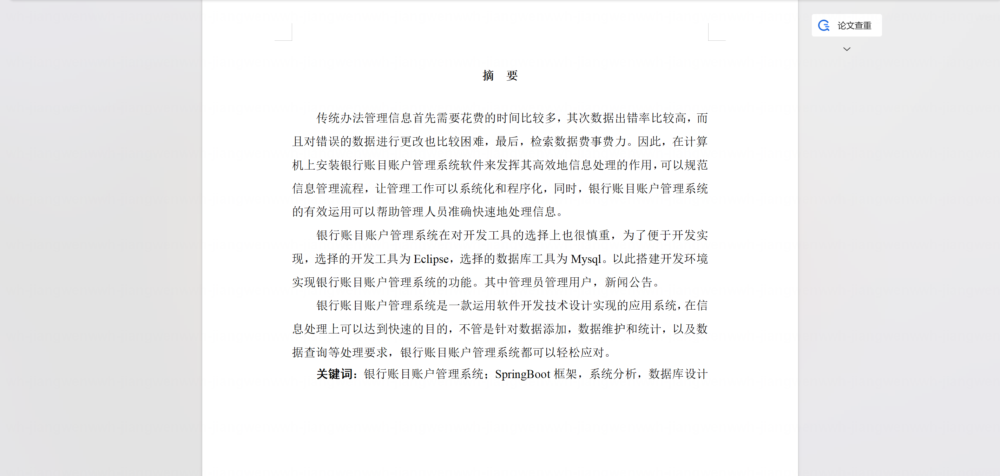

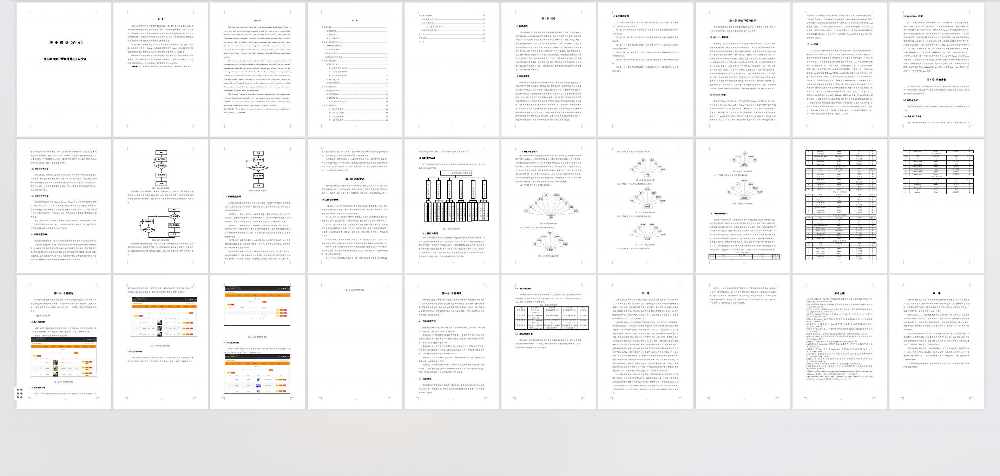

## 系统截图

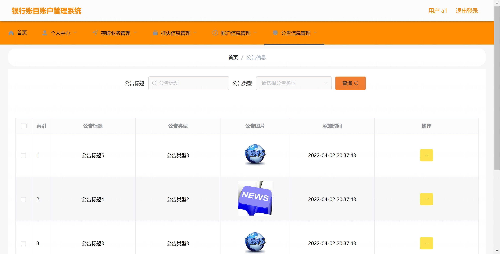

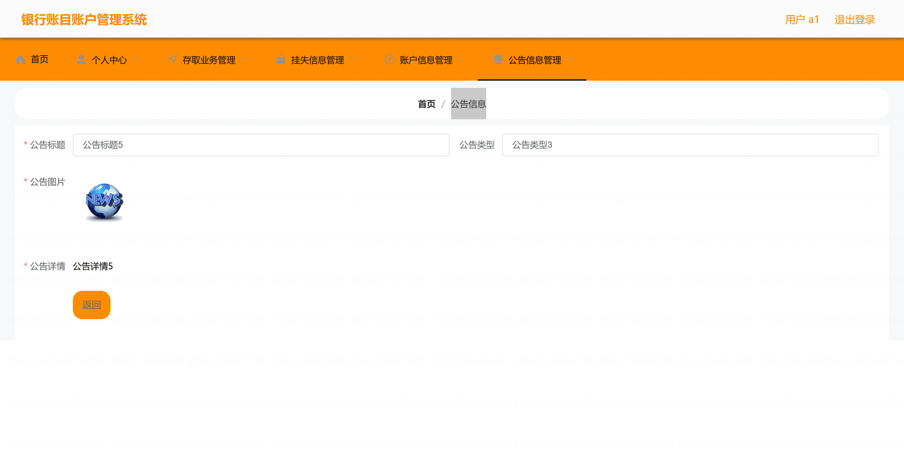

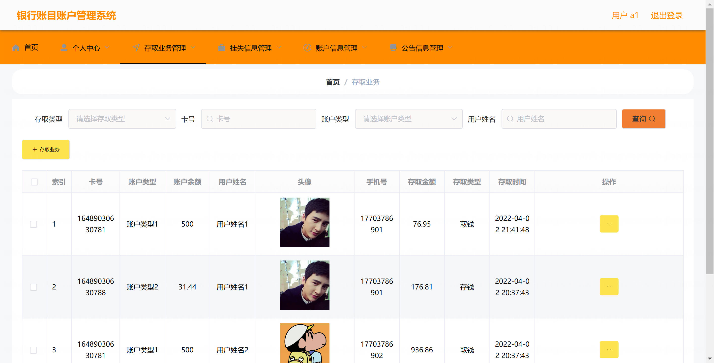

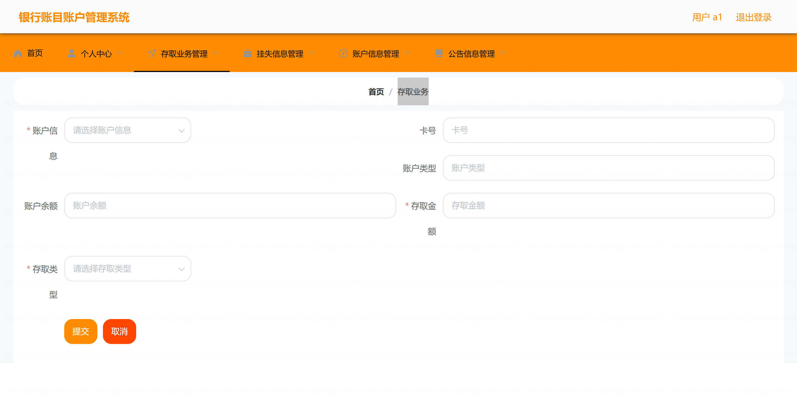

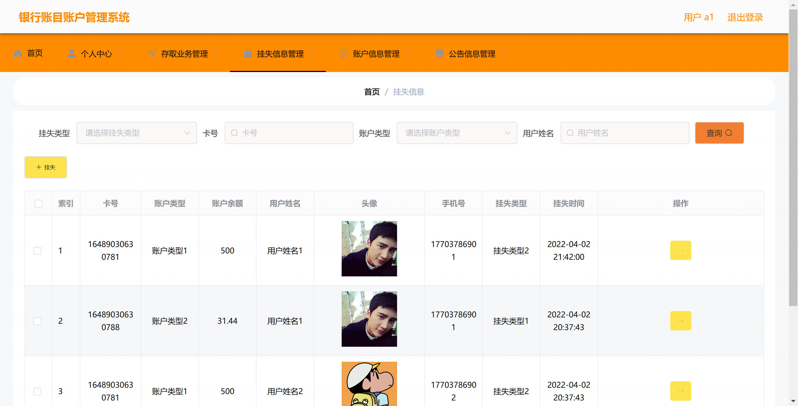

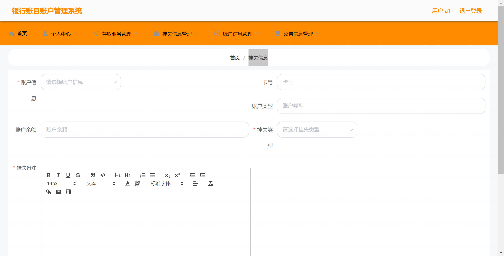

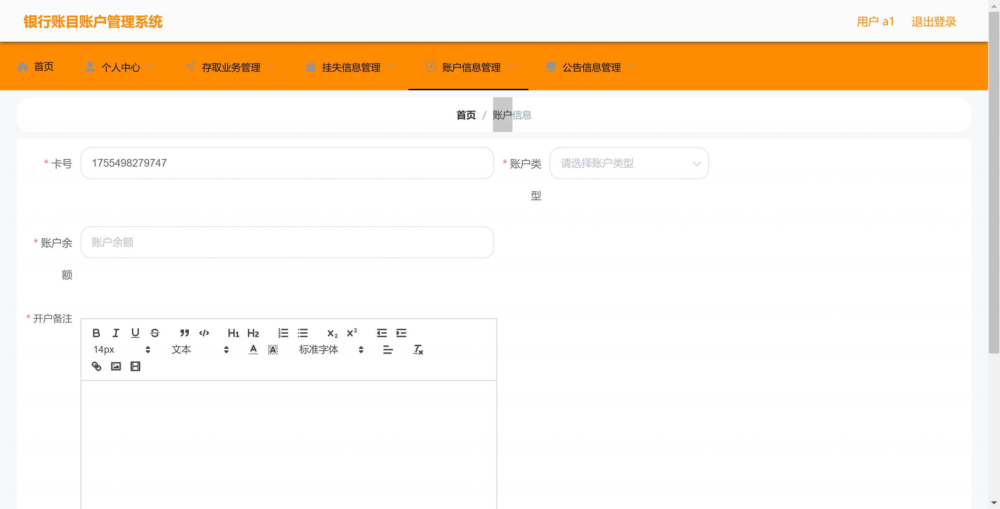

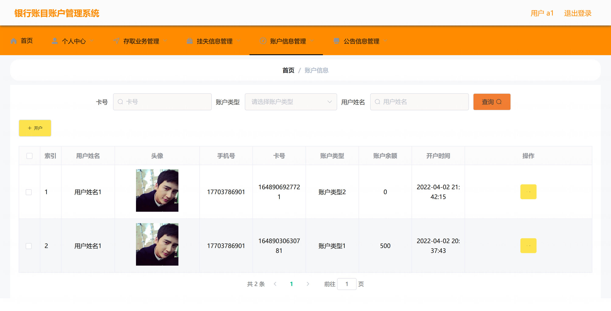

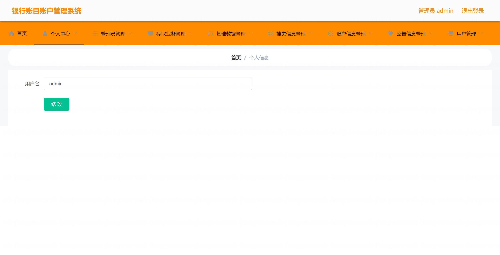